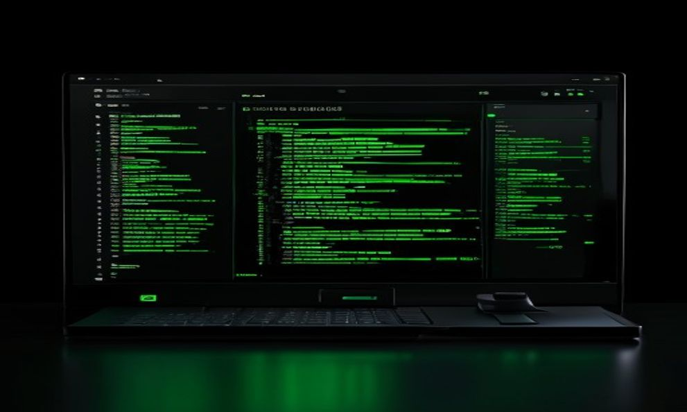
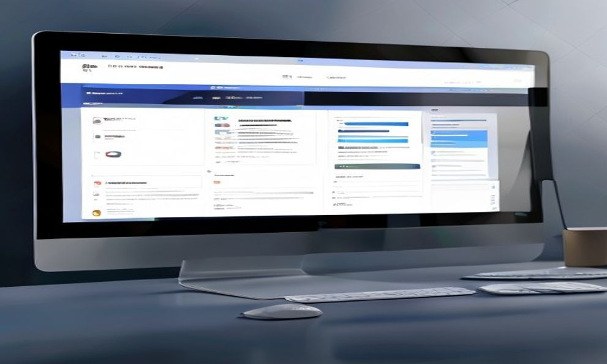

# 🚀 The Complete Guide to Running a Local Server


> **Your Ultimate Resource for Mastering Local Development Servers**  
> *Learn everything from basic concepts to advanced troubleshooting*

---

## 📋 Table of Contents

1. [Introduction](#-introduction)
2. [What is a Local Server?](#-what-is-a-local-server)
3. [Why Use a Local Server?](#-why-use-a-local-server)
4. [Methods to Run a Local Server](#-methods-to-run-a-local-server)
   - [Python HTTP Server](#method-1-python-http-server)
   - [Node.js Express Server](#method-2-nodejs-express-server)
   - [PHP Built-in Server](#method-3-php-built-in-server)
   - [VS Code Live Server Extension](#method-4-vs-code-live-server-extension)
5. [Understanding Ports](#-understanding-ports)
6. [Practical Applications](#-practical-applications)
7. [Troubleshooting Common Issues](#-troubleshooting-common-issues)
8. [Security Best Practices](#-security-best-practices)
9. [Conclusion & Additional Resources](#-conclusion--additional-resources)

---

## 🎯 Introduction

Welcome to the comprehensive guide on running local servers! Whether you're a beginner developer just starting your journey or an experienced programmer looking to refresh your knowledge, this guide will walk you through everything you need to know about setting up and managing local development servers.

A local server is an essential tool in every developer's toolkit, enabling you to test, debug, and preview your web applications before deploying them to production environments.

---

## 💻 What is a Local Server?

A **local server** (also known as localhost) is a web server that runs on your own computer instead of a remote machine. It allows you to develop and test websites and web applications in a controlled environment without needing an internet connection or affecting live users.


### Key Concepts:

- **localhost**: The hostname that refers to your current computer (IP: 127.0.0.1)
- **Port**: A communication endpoint where services listen for connections
- **HTTP/HTTPS**: Protocols used for web communication
- **Request/Response Cycle**: How browsers and servers communicate

When you run a local server, your computer acts as both the client and the server, creating a self-contained development environment.

---

## ✨ Why Use a Local Server?

Running a local server offers numerous advantages for developers:

### 🛡️ Safe Testing Environment
- Test new features without affecting live users
- Experiment with code changes risk-free
- Debug errors without public exposure

### ⚡ Faster Development
- No upload/download delays
- Instant feedback on code changes
- Quick iteration cycles

### 🔧 Full Control
- Access to server logs and debugging tools
- Ability to simulate different scenarios
- Custom configuration options

### 💰 Cost-Effective
- No hosting fees during development
- Free tools and frameworks
- Reduced bandwidth costs

---

## 🛠️ Methods to Run a Local Server

There are several ways to run a local server, each with its own advantages. Let's explore the most popular methods:

---

### Method 1: Python HTTP Server

Python comes with a built-in HTTP server module that's perfect for quick testing and development.

#### Prerequisites:
- Python 3.x installed (check with `python --version`)

#### Starting a Simple Server:

```bash
# Navigate to your project directory
cd /path/to/your/project

# Start the server on port 8000
python -m http.server 8000
```

Or for Python 2.x:
```bash
python -m SimpleHTTPServer 8000
```

#### Expected Output:


You should see output like:
```
Serving HTTP on 0.0.0.0 port 8000 (http://0.0.0.0:8000/) ...
```

#### Access Your Server:
Open your browser and navigate to: `http://localhost:8000`

#### Python Server Code Example:


For more advanced usage, create a custom server script:

```python
# simple_server.py
from http.server import HTTPServer, SimpleHTTPRequestHandler
import os

class MyHandler(SimpleHTTPRequestHandler):
    def do_GET(self):
        if self.path == '/':
            self.send_response(200)
            self.send_header('Content-type', 'text/html')
            self.end_headers()
            self.wfile.write(b'<h1>Welcome to My Local Server!</h1>')
        else:
            super().do_GET()

if __name__ == '__main__':
    server = HTTPServer(('localhost', 8000), MyHandler)
    print('Server running on http://localhost:8000')
    server.serve_forever()
```

Run it with:
```bash
python simple_server.py
```

---

### Method 2: Node.js Express Server

Node.js with Express provides a powerful and flexible way to create local servers with advanced features.

#### Prerequisites:
- Node.js installed (check with `node --version`)
- npm package manager

#### Setup Steps:

1. **Initialize a new project:**
```bash
mkdir my-local-server
cd my-local-server
npm init -y
```

2. **Install Express:**
```bash
npm install express
```

3. **Create your server file (`server.js`):**
```javascript
const express = require('express');
const path = require('path');
const app = express();
const PORT = 3000;

// Serve static files from 'public' directory
app.use(express.static(path.join(__dirname, 'public')));

// Define routes
app.get('/', (req, res) => {
    res.sendFile(path.join(__dirname, 'public', 'index.html'));
});

app.get('/api/data', (req, res) => {
    res.json({ message: 'Hello from local server!', timestamp: new Date() });
});

// Start the server
app.listen(PORT, () => {
    console.log(`Server running at http://localhost:${PORT}`);
});
```

#### Node.js Express Code Example:


4. **Create a public directory and index.html:**
```bash
mkdir public
```

```html
<!-- public/index.html -->
<!DOCTYPE html>
<html lang="en">
<head>
    <meta charset="UTF-8">
    <meta name="viewport" content="width=device-width, initial-scale=1.0">
    <title>Local Server</title>
</head>
<body>
    <h1>Welcome to My Node.js Local Server!</h1>
    <p>Server is running successfully.</p>
    <script>
        fetch('/api/data')
            .then(response => response.json())
            .then(data => {
                document.body.innerHTML += `<p>${data.message}</p>`;
            });
    </script>
</body>
</html>
```

5. **Start the server:**
```bash
node server.js
```

#### Advanced Features:

Add hot reloading with nodemon:
```bash
npm install --save-dev nodemon
```

Update `package.json`:
```json
{
  "scripts": {
    "start": "node server.js",
    "dev": "nodemon server.js"
  }
}
```

Run with auto-reload:
```bash
npm run dev
```

---

### Method 3: PHP Built-in Server

PHP includes a built-in development server perfect for testing PHP applications.

#### Prerequisites:
- PHP installed (check with `php --version`)

#### Starting the Server:

```bash
# Navigate to your PHP project directory
cd /path/to/php/project

# Start the server
php -S localhost:8000
```

Or specify a router script:
```bash
php -S localhost:8000 router.php
```

#### Example PHP Project Structure:
```
my-php-app/
├── index.php
├── about.php
├── css/
│   └── style.css
└── images/
    └── logo.png
```

#### Sample `index.php`:
```php
<?php
// index.php
echo "<h1>Welcome to PHP Local Server!</h1>";
echo "<p>Server time: " . date('Y-m-d H:i:s') . "</p>";

// Display PHP info (remove in production!)
// phpinfo();
?>
```

#### Expected Output:
```
PHP 8.x Development Server (http://localhost:8000) started
```

Access your application at: `http://localhost:8000`

---

### Method 4: VS Code Live Server Extension

For frontend development, the Live Server extension provides instant browser refresh on file changes.

#### Installation:

1. Open VS Code
2. Go to Extensions (Ctrl+Shift+X)
3. Search for "Live Server" by Ritwick Dey
4. Click Install

#### Usage:

1. Open your HTML project folder in VS Code
2. Right-click on any HTML file
3. Select "Open with Live Server"

Or click the "Go Live" button in the status bar.

#### Features:
- ⚡ Auto-refresh on file save
- 🎯 Support for multiple browsers
- 🔧 Custom port configuration
- 🌐 Remote access option

#### Configuration (settings.json):
```json
{
    "liveServer.settings.port": 5500,
    "liveServer.settings.root": "/",
    "liveServer.settings.CustomBrowser": "chrome",
    "liveServer.settings.NoBrowser": false
}
```

---

## 🔢 Understanding Ports

Ports are communication endpoints that allow multiple services to run simultaneously on the same machine.



### Common Ports for Local Development:

| Port | Service | Description |
|------|---------|-------------|
| 80   | HTTP    | Default web server port |
| 443  | HTTPS   | Default secure web server port |
| 3000 | Node.js | Common development port |
| 5000 | Flask   | Python Flask default |
| 8000 | Python  | Python HTTP server default |
| 8080 | Alternative HTTP | Common alternative to 80 |
| 3306 | MySQL   | Database server |
| 5432 | PostgreSQL | Database server |

### How to Check Available Ports:

**Windows:**
```cmd
netstat -ano | findstr :PORT_NUMBER
```

**macOS/Linux:**
```bash
lsof -i :PORT_NUMBER
# or
sudo netstat -tulpn | grep :PORT_NUMBER
```

### Changing Ports:

If a port is already in use, simply choose a different one:

```bash
# Python on port 8080 instead of 8000
python -m http.server 8080

# Node.js on port 4000 instead of 3000
# Update PORT variable in your code
const PORT = 4000;
```

---

## 🎯 Practical Applications

### 1. Testing Static Websites

Quickly preview HTML/CSS/JavaScript projects:

```bash
cd my-website
python -m http.server 8000
# Visit http://localhost:8000
```

### 2. Developing React Applications

Create React App includes a built-in development server:

```bash
npx create-react-app my-app
cd my-app
npm start
# Runs on http://localhost:3000
```

### 3. Building Vue.js Projects

Vue CLI provides a development server with hot reload:

```bash
npm create vue@latest my-vue-app
cd my-vue-app
npm install
npm run dev
# Runs on http://localhost:5173
```

### 4. API Development

Test REST APIs locally before deployment:

```javascript
// Express API example
app.get('/api/users', (req, res) => {
    res.json([
        { id: 1, name: 'John' },
        { id: 2, name: 'Jane' }
    ]);
});
```

### 5. Database Integration

Connect local servers to local databases:

```javascript
const mysql = require('mysql');
const connection = mysql.createConnection({
    host: 'localhost',
    port: 3306,
    user: 'root',
    password: 'password',
    database: 'mydb'
});
```

---

## 🔧 Troubleshooting Common Issues


### Issue 1: Port Already in Use

**Error Message:**
```
Error: listen EADDRINUSE: address already in use :::3000
```

**Solution:**
```bash
# Find the process using the port
lsof -i :3000  # macOS/Linux
netstat -ano | findstr :3000  # Windows

# Kill the process
kill -9 <PID>  # macOS/Linux
taskkill /PID <PID> /F  # Windows

# Or use a different port
const PORT = 3001;
```

### Issue 2: Permission Denied on Port 80

**Error Message:**
```
Error: listen EACCES: permission denied :::80
```

**Solution:**
- Use a port above 1024 (e.g., 8080)
- Or run with sudo (not recommended for development):
  ```bash
  sudo python -m http.server 80
  ```

### Issue 3: Cannot Access from Other Devices

**Problem:** Server only accessible from localhost

**Solution:**
```python
# Python - bind to all interfaces
python -m http.server 8000 --bind 0.0.0.0
```

```javascript
// Node.js - bind to all interfaces
app.listen(3000, '0.0.0.0', () => {
    console.log('Server accessible from network');
});
```

### Issue 4: Browser Shows Blank Page

**Possible Causes:**
- Server not running
- Wrong port number
- Missing index file
- CORS issues

**Debugging Steps:**
1. Check terminal for server status
2. Verify the URL and port
3. Check browser console for errors (F12)
4. Ensure index.html exists in the correct directory
5. Check file permissions

---

## 🔒 Security Best Practices


While local servers are generally safe, follow these best practices:

### ✅ Do's:

1. **Use localhost only for development**
   - Never expose development servers to the public internet
   - Bind to 127.0.0.1 instead of 0.0.0.0 when possible

2. **Keep software updated**
   - Regularly update Node.js, Python, PHP, and dependencies
   - Use `npm audit` to check for vulnerabilities

3. **Disable debug mode in production**
   ```javascript
   // Development
   app.set('env', 'development');
   
   // Production
   app.set('env', 'production');
   ```

4. **Use environment variables for sensitive data**
   ```javascript
   require('dotenv').config();
   const DB_PASSWORD = process.env.DB_PASSWORD;
   ```

5. **Implement rate limiting**
   ```javascript
   const rateLimit = require('express-rate-limit');
   const limiter = rateLimit({
       windowMs: 15 * 60 * 1000,
       max: 100
   });
   app.use(limiter);
   ```

### ❌ Don'ts:

1. **Don't commit sensitive files**
   - Add `.env`, `node_modules`, and config files to `.gitignore`

2. **Don't use weak passwords**
   - Even for local databases

3. **Don't expose admin panels**
   - Restrict access to development tools

4. **Don't ignore security warnings**
   - Address npm/yarn vulnerability alerts promptly

### Sample `.gitignore`:
```
node_modules/
.env
.env.local
*.log
.DS_Store
dist/
build/
```

---

## 🎓 Conclusion & Additional Resources

Congratulations! You've now learned everything you need to know about running local servers. From basic Python HTTP servers to advanced Node.js Express applications, you have the tools to create robust development environments.

### Key Takeaways:

✅ Multiple methods available (Python, Node.js, PHP, Live Server)  
✅ Understanding ports is crucial for avoiding conflicts  
✅ Local servers provide safe, fast development environments  
✅ Troubleshooting skills are essential for smooth development  
✅ Security best practices protect your development workflow  

### Next Steps:

1. **Practice**: Try each method with a simple project
2. **Explore**: Learn about Docker for containerized development
3. **Advance**: Study reverse proxies (Nginx, Apache)
4. **Deploy**: Learn about production server configuration

### Recommended Resources:

- **[MDN Web Docs](https://developer.mozilla.org/)** - Comprehensive web documentation
- **[Node.js Documentation](https://nodejs.org/docs/)** - Official Node.js guides
- **[Python Documentation](https://docs.python.org/)** - Python official docs
- **[Express.js Guide](https://expressjs.com/en/guide/routing.html)** - Express framework tutorial
- **[Stack Overflow](https://stackoverflow.com/)** - Community Q&A

### Quick Reference Commands:

```bash
# Python server
python -m http.server 8000

# Node.js server
npm install express
node server.js

# PHP server
php -S localhost:8000

# Check port usage
lsof -i :PORT  # macOS/Linux
netstat -ano | findstr :PORT  # Windows

# Kill process
kill -9 PID  # macOS/Linux
taskkill /PID PID /F  # Windows
```

---

<div align="center">

### 🌟 Happy Coding! 🌟

*Remember: Every expert was once a beginner. Keep practicing, keep learning!*


**Created with ❤️ for developers worldwide**

</div>
